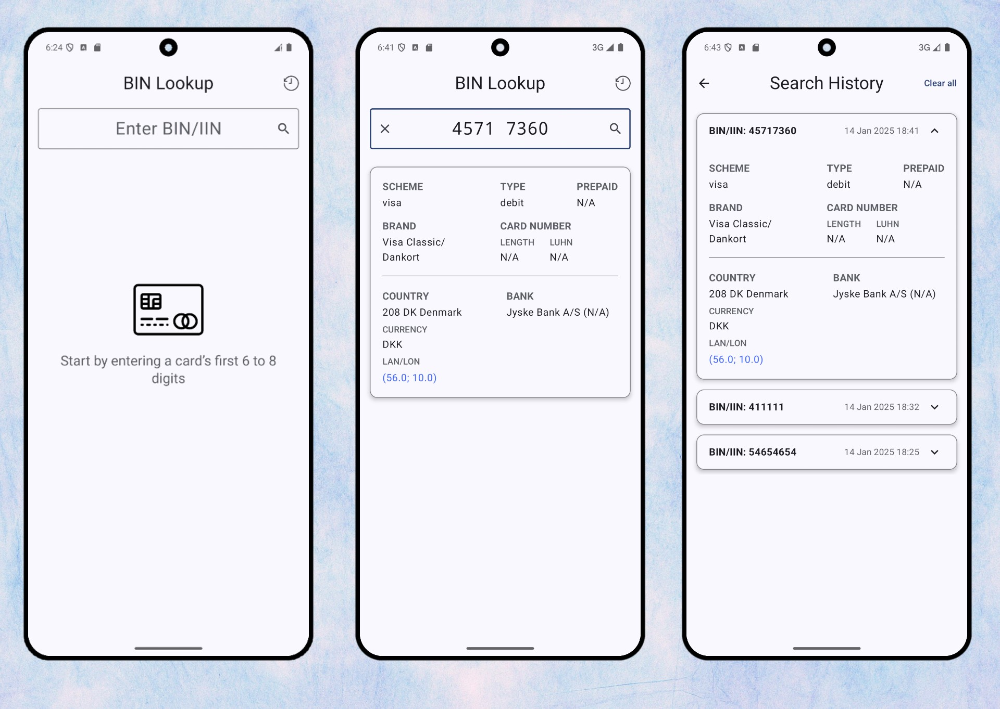

# Приложение для работы с BIN номерами банковских карт

## Описание

Приложение предоставляет пользователю возможность вводить BIN банковской карты и получать информацию, используя данные, загруженные с сервиса [Binlist.net](https://binlist.net/). Реализованы следующие функции:

### Первый экран
- Пользователь вводит BIN и получает информацию:
    - Страна выпуска карты.
    - Координаты (широта и долгота).
    - Тип карты (Visa, MasterCard и т.п.).
    - Данные банка (URL, телефон, город, название).
- При нажатии на:
    - URL банка — открывается браузер.
    - Номер телефона банка — запускается приложение для звонков.
    - Координаты страны — открывается приложение карт.
- Возможность перейти на экран со списком запросов истории BIN номеров.

### Второй экран
- Отображение списка запросов BIN номеров с данными, ранее полученными с сервиса.
- История сохраняется при перезапуске приложения.
- Реализована возможность очистки истории запросов.

## Скриншоты

## Стек технологий
-  **Архитектура**: Многомодульный проект, Clean Architecture + MVVM
- **UI**: Jetpack Compose
- **Dependency Injection**: Hilt
- **База данных**: Room
- **Сетевые запросы**: Retrofit
- **Асинхронное программирование**: Kotlin Coroutines
- **Тестирование**: Выполнены базовые юнит-тесты для репозитория и DAO, дополнительно покрыты оба экрана простыми UI-тестами

